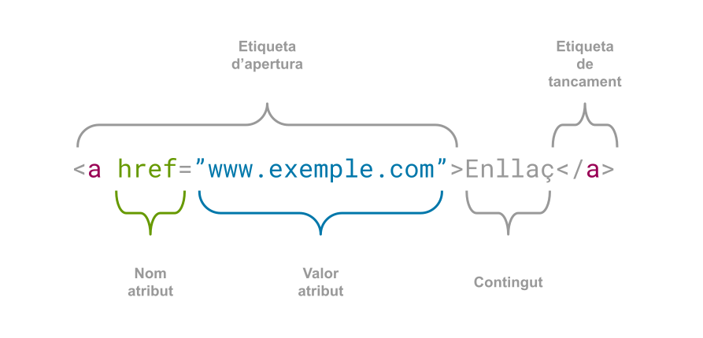
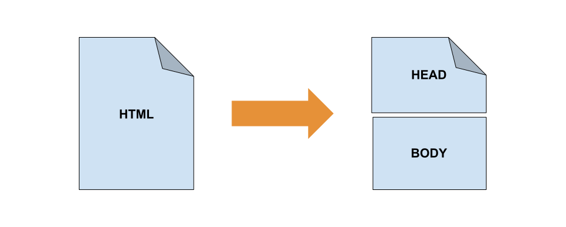
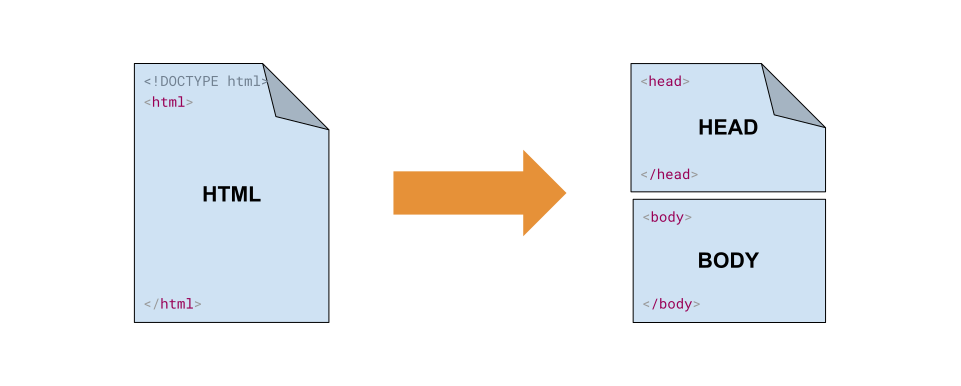

# Etiquetes bàsiques

## Etiquetes i atributs

Les etiquetes en HTML són els elements que s’utilitzen per a **estructurar** i **marcar** el contingut d’un document i són l'element fonamental per a la construcció de pàgines web i la definició de la seua estructura. 

Cada etiqueta pot comptar amb atributs que s’inclouen en la seua definició i que **proporcionen informació addicional** sobre com s’ha de processar i mostrar.

A continuació s'especifiquen les característiques bàsiques d'una etiqueta:

<figure markdown="span" style="width:100vw">
    
    <figcaption>Figura 2.1.1 Parts d'una etiqueta</figcaption>
</figure>

### Nom de l'etiqueta

Les etiquetes tenen un nom que identifica l'element al qual representen. El nom de l'etiqueta es posa entre els caràcters `'<'` i `'>'`: 
```html
<nom_etiqueta>
```
### Obertura i tancament

La majoria de les etiquetes d’HTML consten de dues parts, la part d’obertura i la de tancament. La diferència entre elles és que la tancada inclou el caràcter `‘/’` abans del nom de l’etiqueta:
```html 
<etiqueta>Contingut</etiqueta>
```
### Etiquetes auto-tancades

Algunes etiquetes poden ser auto-tancades. Això significa que no disposen d'una etiqueta de tancament i incorporen  La utilització del caràcter `‘/’`és opcional i l'etiqueta és vàlida, tant si incloem el caràcter `‘/’` com si no: 
```html
<br>
<br/>
```
### Atributs

Moltes etiquetes consten d’atributs que proporcionen informació addicional sobre l’element. Els atributs es col·loquen a l’etiqueta d’obertura i estan formats per un nom i un valor separats per un signe d’igual `‘=’`. El valor ha d’anar entre comes simples `‘‘` o comes dobles `““`. Els atributs serveixen per a controlar aspectes com l’aparença, el comportament i altres característiques. En el següent exemple trobem el cas de l’etiqueta `img`, que com es pot veure consta de dos atributs: `src` i `alt`:
```html
``.
```
### Comentaris

El comentari és una forma de proporcionar anotacions o explicacions que no es mostren als visitants de la pàgina. Es tracta d’una manera de documentar el codi HTML perquè els desenvolupadors puguen comprendre millor l’estructura o per a deixar notes internes. Els comentaris no són interpretats pel navegador i són ignorats a l’hora de mostrar la pàgina final.  A l’hora de posar comentaris has de tindre en compte que:

- Comencen amb `‘<!-- ‘` i acaben amb `‘-->’`.
- Poden abastar una o diverses línies de text.
- No tenen cap efecte sobre la representació de la pàgina web, i per tant, no són visibles als usuaris.

La sintaxi d’un comentari és la següent:

```html
<!--Aquest és un comentari d’una línia HTML -->
<!-- 
Aquest és un comentari que abasta diverses línies. 
Pots afegir tanta informació com necessites
-->
```

## Estructura d'un document

Un document HTML té una estructura jeràrquica que està composta principalment pels següents elements.

<figure markdown="span" style="width:100vw">
    
    <figcaption>Figura 2.1.2 Estructura del Document</figcaption>
</figure>

### Etiqueta DOCTYPE
Representat per l’etiqueta `<!DOCTYPE>`, es situa en la primera línia d’un document HTML. Conté la declaració en la que s’especifica la versió d’HTML que s’està utilitzant. Aquesta etiqueta ajuda al navegador a interpretar correctament el document. En HTML5, a diferència d’anteriors versions només cal especificar que el tipus de document és HTML, sense fer referència a la versió.

```html
<!DOCTYPE html>
```
??? note "Més informació"
    Més informació sobre l'etiqueta [ací](https://www.w3schools.com/tags/tag_doctype.asp)

### Etiqueta HTML

És l’element arrel del document i engloba a tot el contingut de la pàgina. Conté dos elements fills, el `‘<head>’` i el `‘<body>’` que representen les dos seccions principals del document. Opcionalment podem establir l’atribut `lang` per a especificar l’idioma del document.

```html
<html>
	<head> 
    </head>
	<body> 
    </body>
</html>
```
??? note "Més informació"
    Més informació sobre l'etiqueta [ací](https://www.w3schools.com/tags/tag_html.asp)

### Etiqueta HEAD

Dins de la secció `‘<head>’` es poden incloure metadades com ara el títol de la pàgina, la codificació de caràcters, les descripcions de pàgina (metaetiquetes), enllaços a fulls d’estil, scripts i altres elements relacionats amb la configuració i el comportament de la pàgina.

```html
<head>
	<meta charset=”UTF-8”>
	<title> Títol de la pàgina </title>
	<link rel=”stylesheet” href=”stils.css”>
</head>
```
??? note "Més informació"
    Més informació sobre l'etiqueta [ací](https://www.w3schools.com/tags/tag_head.asp)

### Etiqueta BODY

El contingut que es mostrarà en la pàgina s’inclou dins de la secció `‘<body>’`, com ara, text, imatges, enllaços, taules i altres elements HTML.

```html
<body>
    <h1>Títol principal</h1>
    <p>Aquest és un paràgraf de text.</p>
    
    <a href=”https://www.exemple.com”>Enllaç a l’exemple</a>
</body>
```
??? note "Més informació"
    Més informació sobre l'etiqueta [ací](https://www.w3schools.com/tags/tag_body.asp)

<figure markdown="span" style="width:100vw">
    
    <figcaption>Figura 2.1.3 Estructura del Document</figcaption>
</figure>
